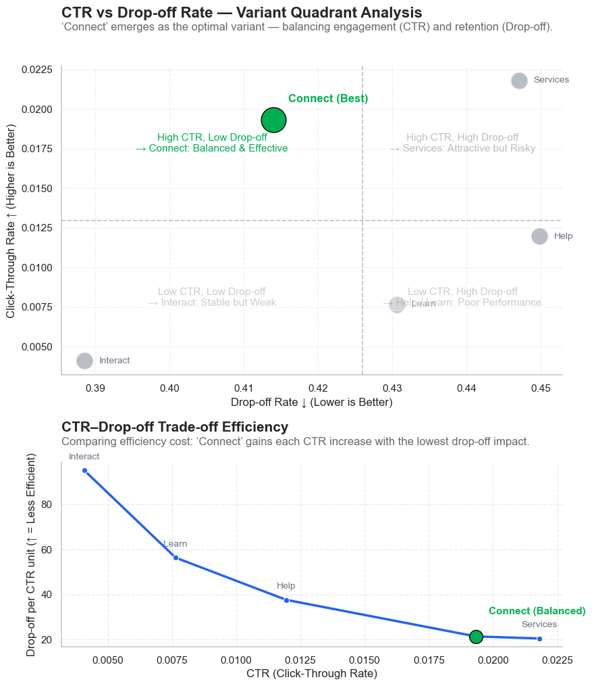

# 📊 CTR and Drop-off Rate Optimization through A/B Testing using Python

This project analyzes multiple webpage variants from the **MSU Library website** to evaluate **user engagement (CTR)** and **retention (Drop-off Rate)**.  
Through **A/B/n testing and statistical hypothesis testing**, the goal is to identify the most effective variant balancing engagement and retention.

---

## 🧠 Project Overview
- **Objective:** Determine which webpage design drives higher CTR without significantly increasing Drop-off Rate.  
- **Dataset:** Google Analytics data from the [Montana State University Library A/B Testing Dataset](https://scholarworks.montana.edu/items/ac4aa35e-e5b6-4c60-b0c3-6a60ef0584f2)  
- **Dataset Description:** Contains user traffic, click, and navigation metrics across multiple test variants of the library’s website.  
- **Methodology:**
  - Metric extraction and preprocessing  
  - CTR & DoR computation  
  - Chi-square and Z-test hypothesis validation  
  - Visualizations and trade-off quadrant analysis

---

## 📈 Key Insights
- **Connect** variant achieves the **best balance** — higher CTR with moderate Drop-off.  
- **Services** drives the **highest CTR** but suffers from excessive exits.  
- **Help** shows the **highest Drop-off Rate**, indicating potential UX issues.  
- **Recommendation:** Adopt **“Connect”** variant, as the business goal prioritizes CTR improvement.

   
  <em>Quadrant visualization showing CTR–Drop-off trade-off across webpage variants.</em>

---

## 🛠️ Tech Stack
- **Language:** Python  
- **Libraries:** pandas, numpy, scipy, seaborn, matplotlib  
- **Environment:** Jupyter Notebook / VS Code  
- **AI Assistance:** OpenAI GPT-5 (for code optimization and report writing support)